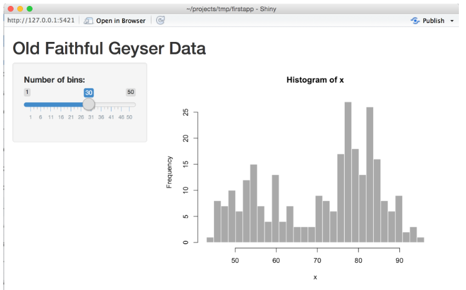
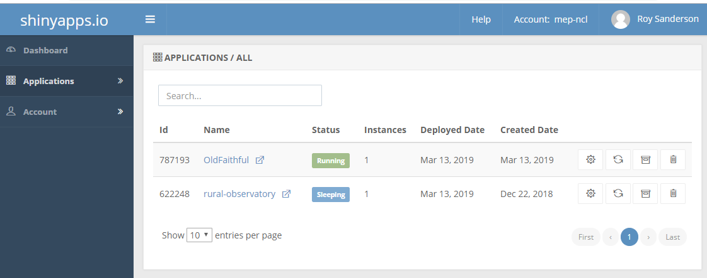

```{r setup, include=FALSE}
knitr::opts_chunk$set(echo = TRUE)
```

## 1. Introduction
When designing and writing shiny applications it is easy to become confused by the R code, as the code in the user-interface (`ui`) and `server` functions is difficult to debug. The simplest approach is to compartmentalise different tasks, testing them in standard R scripts, and either calling these at the start of the main `app.R` code using the `source` function to setup various initial parameters, creating functions than can be re-used later, or integrating them into the `server` code once you know the original R code is robust. Good coding practices will help you do this effectively and well. Finally, you want others to be able to use your shiny app, so you have to know how to publish it on the web. The main aims of this practical are to:

* learn how to plan a shiny app, how to structure and test it
* good coding practice, shiny reactive programming
* publishing your app on the web

## 2. Planning your shiny app
Decide on who will be your users: how much technical skills will they have, and what will they want to gain through using your shiny app?  For your assignment, assume that your end-users might be informed members of the public, wanting to gain a more in-depth understanding of the environment and ecology in Cumbria.  Sketch out on paper what you would like your shiny app to be able to show, what data (maps, graphs, tables) do you want displayed. How might you want your user to interact with your shiny app? Do you want the user to be presented with a single page, that they can scroll down (much simpler to build), or separate tabs on a dashboard (harder to code).


## 3. Prototyping your shiny app
Spend some time thinking carefully about the user interface (UI) part of your application. Ideally you want to design this and check that it _roughly_ behaves as expected before you invest a lot of time on the `server` code. A good place to start is the Shiny Gallery where you can look at example interfaces, read their code, and even see which lines of code are responding to different user-interactions dynamically.  You can find Shiny Gallery at <https://shiny.rstudio.com/gallery/> 

* Begin by looking at the the section marked `Start Simple` where you can learn about simple methods, particularly the "iris dataset" <https://shiny.rstudio.com/gallery/kmeans-example.html> scatterplot and "Telephones by region" <https://shiny.rstudio.com/gallery/telephones-by-region.html>. **Note** Originally shiny apps had to be written with the `ui` and `server` in separate R files, but this is now optional and they can be both stored in a single `app.R` file.

* The section entitled `Widgets` gives simple examples of how to use check boxes, drop-down lists, sliders, graphs, tables of data etc. Explore some of these, particularly those that you think might be useful to your app. **Exercise**: Copy the code of one or two widget examples and test them: this is the only real way of learning what they do.

* Decide whether you want a long-style of website or a dashboard. An example long-style website is that of the USGS Biological Monitoring Station at Lake Erie <https://gallery.shinyapps.io/lake_erie_fisheries_stock_assessment_app/>. This is a single long page, with all the different graphical interfaces visible as you scroll down. Dashboards are more difficult to code, requiring the use of the `shinydashboard` add-on package <https://rstudio.github.io/shinydashboard/index.html>. As this is more complex, have a look at some of the examples before deciding whether to go down this route.

## 4. Testing your prototype
It is difficult to test a prototype user-interface without having all the server components written already, which can be frustrating if you want to focus on the user-interface design initially. The `shinipsum` package comes with random plots, images, tables of data etc. that you can use in an interface, without needing to worry about the detail of the backend. The package is now available on CRAN:

```{r installing shinipsum, eval=FALSE}
# Note: installing shinipsum will also install lots of extra packages
install.packages("shinipsum")
```

You can then experiment by creating a very simple shiny app with some random components. This one creates a user-interface with an image, a ggplot, some printed output, a table, and some text. Obviously, the values and contents are random.

```{r shinipsum example, eval=FALSE}
library(shiny)
library(shinipsum)
library(ggplot2)
ui <- fluidPage(
  h2("A little random image"),
  plotOutput("image", height = "300px"),
  h2("Some sort of plot"),
  plotOutput("plot"),
  h2("A Random Print statement"),
  verbatimTextOutput("print"),
  h2("A Random Table"),
  tableOutput("table"),
  h2("A bit of random Text"),
  tableOutput("text")
)

server <- function(input, output, session) {
  output$image <- renderImage({
    random_image()
  })
  output$plot <- renderPlot({
    random_ggplot()
  })
  output$print <- renderPrint({
    random_print("model")
  })
  output$table <- renderTable({
    random_table(10, 5)
  })
  output$text <- renderText({
    random_text(nwords = 50)
  })
}
shinyApp(ui, server)

```

Try running the above code to produce your "random" user-interface. The start to modify it to what you might want. e.g. with a drop down menu, or click boxes etc. The `shinipsum` does not allow you to display a random `leaflet` map, but hopefully it will give you a feel for how to assemble the user interface. The `shinipsum` package also has options to display a random `ggplotly` graph and random data-table display (requires `ggplotly` and `DT` packages).

## 5. Coding the server
You will find it easiest to code different parts of the server backend as separate R scripts, to check that they work correctly outside of `shiny`, read any input data files etc. Sometimes you might be able to use the `source` command near the top of your `app.R` script, so that you can keep your main code uncluttered, especially if you want to put your own user-written functions into separate files. We did something similar in the first practical on oystercatchers, where most of you put the `multiplot` function into a separate R script called `multiplot.R` which you were able to source from the start of your analysis, without cluttering up your main code for the oystercatcher analysis.

## 6. Good coding practice
It is worth using a consistent coding style, as it reduces errors and makes it easier to spot mistakes. Here are a few hints:

### 6.1 Object names
Moderate length names, that are clear and accurately describe what the object contains or what it does are best. Variables using `snake_case` are usually easier to read than `CamelCase`.

```
# Good
total_sheep
population_size
soil_type
calc_rainfall  # This is obviously a function rather than a variable
plot_rivers    # A function, similar to the multiplot example

# Bad
tmp # I will admit guilt on this one!
TotSheep
PopulationNO
Rainfall_Amount
stagnohumic_gley_soil_per_ha
````
### 6.2 Comments
Good comments are succinct but add to the clarity of the code. Use of good variable and function names helps to make the code partially self-documentating, but you will always need comments to remind both yourself and others what you did. Imagine you will be readiing the code in 6, 12 or 18 months time. Will you still be able to understand what it says? I have sometimes looked at old code that I have written a year earlier and puzzled about it. Also remember that if you end a comment with `####` or `----` you automatically create a table of contents to help you navigate your code. You can put long comments on a series of separate lines, moderate ones on a single line, or very short ones on the same line as code. Leave a space between the `#` symbol and the comment, so that you can easily use the **CTRL-Shift-C** keyboard shortcut to comment and uncomment blocks of text. Try to avoid comments more than 80 columns wide as they will not print or display as easily. You can set RStudio to display an 80 column guideline.

```
# Good
# Read and clean raw soil data
# Function to display river data with vector input ####
# Next section reprocesses altitude data ----

# Next section of code derived from that published in Smith and Jones (2015)
# in Journal of Exciting Ecology, 23, 1-10.
grassland_type <- vegetation_community[nvc_type] # National Vegetation Class


# Bad
# Sort out the data
# Correct the errors earlier
# Tidy up the data
#Forgot to leave a space
# Next section of code derived from paper published that describes use of vegetation types in ecology and is relevant for this study 
grassland_type <- vegetation_community[nvc_type] # Assign grassland_type
```

#### 6.3 Spaces, assignments and indentation
Good use of these relatively simple elements greatly improves readibility.

```
# Assignment
rainfall <- 25 # Good
rainfall =  25 # Bad
rainfall=25    # Bad
rainfall<- 25  # Bad
rainfall  <-25 # Bad

# If you have assignments for related code, allign the operators
# Good
sheep_per_ha  <- 25
cattle_per_ha <- 8
pigs_per_ha   <- 2


# Bad
sheep_per_ha <- 25
cattle_per_ha <- 8
pigs_per_ha <- 2

# Indent with 2 spaces in general
# Good
if (y < 0 && debug) {
  message("Y is negative")
}

if (y == 0) {
  log(x)
} else {
  y ^ x
}

# Bad: no indentation
if (y < 0 && debug)
message("Y is negative")

# Bad: curly { brackets scattered across too many lines
if (y == 0)
{
  log(x)
} 
else
{
  y ^ x
}
```

One exception to the 2 indent rule might be where you have a long function with lots of function arguments that would run over multiple lines, for example:
```
long_function_name <- function(a = "a long argument", 
                               b = "another argument",
                               c = "another long argument") {
  # As usual code is indented by two spaces.
}
```

## 7. Publishing shiny apps on the web for anyone to use
Currently you have 'hosted' all your shiny apps on a 'local' server, that is on the PC on which you are developing your shiny application. However, to allow anyone to use a shiny app you need to 'publish' it on an internet server. RStudio provides a 'shiny server' application, which you can run on your own internet-enabled server. However, this would require you to manage the server, in particular to control security, passwords etc. A simpler solution that also can be used when you don't have a server, is to host your shiny app on the <https://www.shinyapps.io/> website. You can sign-up for a free account, and login with your github account. The free (Basic) allows a maximum of 5 shiny applications, with 25 active hours. You can control when to start or stop applications from within the shinyapps control board.

**Note**: To learn how to use shinyapps.io I suggest you test it out with a 'dummy' shiny project (you can base it on the Old Faithful geyser or one of the earlier simple shiny apps you have created).

Begin by logging into <https://www.shinyapps.io/> using your Github username and password. The first time you sign in, shinyapps.io prompts you to set up your account. Shinyapps.io uses the **account name** as the domain name for all your apps. Account names must be between four and 63 characters and can contain only letters, numbers, and dashes (-). Account names may not begin with a number or a dash, and they can not end with a dash (see RFC 952). Some account names may be reserved already. So, if you use **davidsmith** as your account name, and load up a shiny app called `rural-cumbria`, your web address will be `https://davidsmith.shinyapps.io/rural-cumbria`.  The text `shinyapps.io` is present in the free account: you need to subscribe to a paid service to have greater flexibility over the web domain name.


### 7.1 Deploying shiny apps
Once you have setup your shinyapps.io account your are ready to deploy your app. To do this you need to install the `rsconnect` package and configure it to connect to your account:

```{r install rsconnect, eval=FALSE}
install.packages("rsconnect")
library(rsconnect)
```

Next, go to the shinyapps website, and after logging in via Github, click on your user-name (top right) and the "Tokens" button:

Click the Show button on the Token page. A window will pop up that shows the full command to configure your account using the appropriate parameters for the rsconnect::setAccountInfo function. Copy this command to your clipboard, and then paste it into the R **console** in the RStudio IDE and hit Enter.

Now check that your shiny app runs: for this simple initial example I'm assuming that you are using the Old Faithful geyser eruptions example. (**Note**: on some machines I have sometimes encountered problems deploying shiny apps from network drives, and if this proves to be a problem, see below.) When you run the shiny app it will display in a window by default:



At the top-right is a button called "publish" and when you press this your app should be deployed to shinyapps.io. A popup window will ask you to confirm what is to be deployed. Note that if it is a large app, with lots of packages to install, this may take a while, as the packages will need to be installed on the remote deployed app. Alternatively, use the `deployApp` command directly from the Console:

```{r deploy app, eval=FALSE}
library(rsconnect)
deployApp()
```

and you should see something similar to the following, which takes about 3 to 4 minutes on my PC for the Old Faithful geyser example:

```
Preparing to deploy application...DONE
Uploading bundle for application: 787193...DONE
Deploying bundle: 1936830 for application: 787193 ...
Waiting for task: 595108460
  building: Fetching packages
  building: Installing packages
  building: Installing files
  building: Pushing image: 2027512
  deploying: Starting instances
  rollforward: Activating new instances
  success: Stopping old instances
Application successfully deployed to https://mep-ncl.shinyapps.io/OldFaithful/
Deployment completed: https://mep-ncl.shinyapps.io/OldFaithful/
```

All being well, your shiny app will automatically open in a web-browser, with an internet account.

**Possible problems**: the main problems I have encountered are associated with the need for additional libraries and/or network drives. Sometimes deployment requires additional libraries to be installed (e.g. `RJSON`). Clicking the "Publish" button at the top right of your shiny app seems more reliable at detecting this need. If when you click the "Publish" button or issue `deployApp()` and nothing happens (no messages on the screen) then the network drive might be causing problems. You can resolve this issue by opening _File Manager_ and copying your entire project file to `C:\TEMP\<your user name>` on your local machine. Then open RStudio again, and see if you can deploy the app (you might need to confirm the tokens again).

### 7.2 Working with the shinyapps.io dashboard
The shinyapps dashboard allows you to configure some aspects of your apps. With a free account, you can only have 5 running applications, so you may want to archive applications, or delete some with the appropriate buttons. You can also change the amount of time before they go from actively running into "sleep" mode. By default you get 25 hours of active CPU time per month for your apps with a free account, which should be sufficient for this module. If you are concerned that you might exhaust the limit (unlikely), reduce your "sleep" mode time-out from the default of 15 minutes to 5 minutes.




